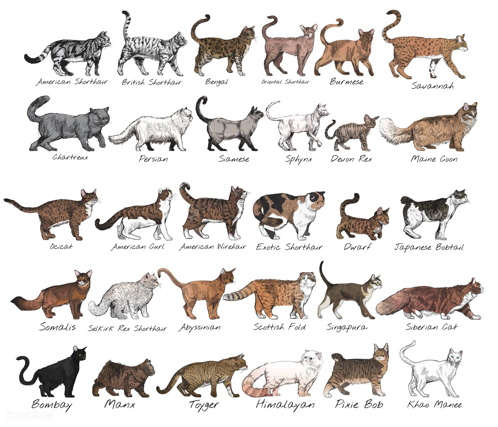
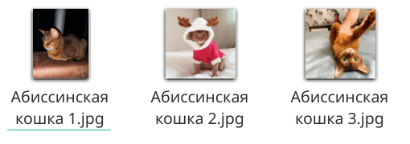

# Фотографии кошек различных пород

## Авторы
Юрий Котеленко, Юлия Черганова, Елена Терещенко, Евгений Иванов, Сергей Гурылёв

## Описание
Датасет содержит образцы изображений, на которых сфотографированы кошки различных пород. Такой датасет может использоваться для обучения модели, классифицирующей домашних питомцев по породам. Такая модель может использоваться при организации выставок, проводимых Всемирной федерацией кошек (World Cat Federation, WCF). Применение такой потенциальной модели может стать оптимизация работы судей по первичной оценке породы животного. Также модель разпознавания пород может быть использована как часть развлекательного контента рекламных кампаний производителей
кормов. Потенциальный клиент делает фотографию животного - получает справку по породе и рекомендуемый корм, который сразу же можно заказать.

## Источники
В качестве источников изображений использовался сайт https://lapkins.ru/ 

## Методы сбора и обработки
Для сбора изображений с сайта нами был написан веб-скрапер. Сайт содержит страницу https://lapkins.ru/cat со списком всех пород. Сделав парсинг этой страницы мы получили название всех пород и ссылки на страницу каждой породы. Итеративно пройдя в цикле по каждой из пород, мы получили все изображения и сложили их в соответствующие папки.

## Структура репозитория
Каталог Cats_lapkins содержит папки, название которых соответствует названию породы кошки.

Репозиторий содержит 64 каталога для каждой породы. Всего в датасете содержатся 2600 изображений. 
Все изображения представлены в формате .jpg. 
Формат названия файлов: например, “Абиссинская кошка 2.jpg”, в начале идет название породы, после число - порядковый номер образца.
